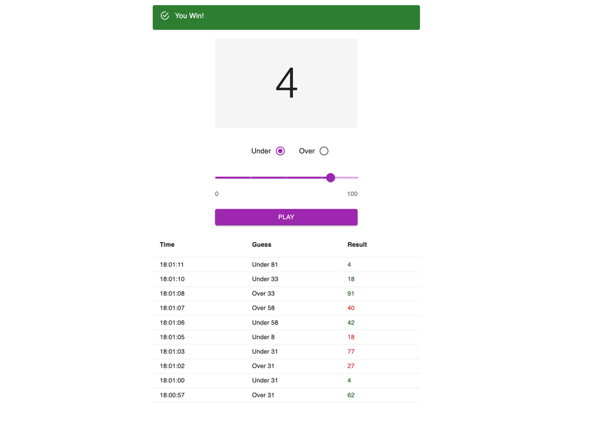

# Dice Game

A simple and interactive over/under guessing game built with Next.js, TypeScript, and Material-UI.



## 🎮 Game Description

This is a number guessing game where players try to predict whether a randomly generated number (0-100) will be **over** or **under** their chosen threshold.

### Game Rules

1. Choose a number between 0 and 100 using the slider
2. Select whether you think the random number will be **Over** or **Under** your chosen number
3. Click **Play** to generate a random number
4. **Win conditions:**
   - If you chose "Under" and the random number is less than your guess - You Win!
   - If you chose "Over" and the random number is greater than your guess - You Win!
5. **Loss conditions:**
   - If the random number equals your guess - You Lose!
   - If your prediction was wrong - You Lose!

### Features

- 🎲 **Random number generation** from 0 to 100
- 📊 **Game history table** showing your last 10 games
- 🎯 **Visual feedback** with success/error alerts
- 📱 **Responsive design** that works on all devices
- ⚡ **Real-time updates** with no page refresh needed

## 🚀 Getting Started

### Prerequisites

- Node.js 18+ installed on your machine
- npm, yarn, pnpm, or bun package manager

### Installation

1. Clone the repository:
```bash
git clone https://github.com/bFilimonenko/dice-game.git
```

2. Install dependencies:
```bash
npm install
# or
yarn install
# or
pnpm install
# or
bun install
```

### Running the Development Server

```bash
npm run dev
# or
yarn dev
# or
pnpm dev
# or
bun dev
```

Open [http://localhost:3000](http://localhost:3000) with your browser to see the game.

### Building for Production

```bash
npm run build
npm start
```

## 🛠️ Tech Stack

- **[Next.js 16](https://nextjs.org/)** - React framework with App Router
- **[TypeScript](https://www.typescriptlang.org/)** - Type-safe JavaScript
- **[Material-UI (MUI)](https://mui.com/)** - React UI component library
- **[Emotion](https://emotion.sh/)** - CSS-in-JS styling solution
- **[ESLint](https://eslint.org/)** - Code linting
- **[Prettier](https://prettier.io/)** - Code formatting

## 📁 Project Structure

```
dice/
├── app/
│   ├── components/
│   │   ├── GameAlert.tsx      # Win/loss alert component
│   │   ├── GameBoard.tsx      # Main game interface component
│   │   └── ResultsList.tsx    # Game history table component
│   ├── utils/
│   │   ├── constants.ts       # Game constants (min/max values, etc.)
│   │   ├── types.ts           # TypeScript type definitions
│   │   └── index.ts           # Utility exports
│   ├── favicon.ico            # App favicon
│   ├── globals.css            # Global styles
│   ├── layout.tsx             # Root layout component
│   └── page.tsx               # Main page with game logic
├── public/
│   └── screenshot-dice-game.png  # Game screenshot
├── .prettierrc                # Prettier configuration
├── .prettierignore            # Prettier ignore rules
├── eslint.config.mjs          # ESLint configuration
├── next.config.ts             # Next.js configuration
├── tsconfig.json              # TypeScript configuration
├── package.json               # Dependencies and scripts
└── README.md                  # Project documentation
```

## 🎯 Component Overview

### GameBoard
The main game interface featuring:
- Number display
- Over/Under radio buttons
- Interactive slider (0-100)
- Play button

### GameAlert
Displays game results with:
- Success/error styling
- Win/loss messages
- Click-to-dismiss functionality
- Smooth animations

### ResultsList
Shows game history with:
- Time of each game
- Your guess (Over/Under + number)
- The actual result
- Win/loss indicator with color coding

## 🎨 Color Scheme

- **Success**: Green (when you win)
- **Error**: Red (when you lose)
- **Primary**: Purple accents
- **Background**: Clean white

## 📝 Available Scripts

- `npm run dev` - Start development server
- `npm run build` - Build for production
- `npm start` - Start production server
- `npm run lint` - Run ESLint
- `npm run format` - Format code with Prettier

## 🤝 Contributing

Contributions are welcome! Feel free to submit issues and pull requests.

## 📄 License

This project is open source and available under the MIT License.

---

**Enjoy the game! 🎲**

